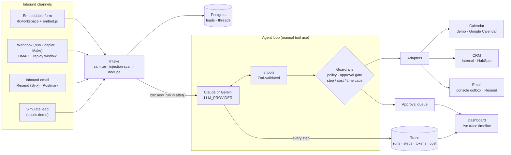

# LeadPilot — AI Lead Qualification & Booking Agent

**An autonomous agent that handles inbound leads end to end: it qualifies the lead against your
Ideal Customer Profile with an LLM (Claude or Gemini), asks for missing details, books a meeting
when the lead fits, updates your CRM and sends the follow-up email — and shows every decision it
made in a live, inspectable agent trace.**

Leads come in from an embeddable web form, email replies, or any automation tool (n8n, Zapier, Make)
via a signed webhook. Runs in **demo mode** with just a Postgres URL and an LLM key (a free Gemini
key works); add Google Calendar, HubSpot and Resend keys to switch to the real integrations.


<!-- TODO(media): record docs/media/hero-trace.gif — see docs/media/README.md -->

> Built with Next.js 16 (App Router) · TypeScript (strict) · Postgres + Drizzle · native tool use with
> **Claude** (official Anthropic SDK) or **Gemini** (REST `generateContent`) · Zod · Tailwind + shadcn/ui · Vitest.

---

## What it does

- **Qualifies** each lead (score 0–100, BANT: budget, authority, need, timeline, with reasoning) against
  a plain-text ICP and rules you edit in Settings.
- **Acts** on the result: books a discovery call for qualified leads, asks one concise follow-up for
  promising-but-incomplete ones, politely declines genuine poor fits, silently disqualifies spam.
- **Writes** the outcome to the CRM and replies in the lead’s language.
- **Shows its work**: every model call and tool call is stored with input, output, tokens, cost and
  latency, and rendered as a timeline that fills in live while the agent runs.
- **Keeps a human in the loop** when you want: outward actions (bookings, emails) can be held in an
  approval queue where an admin approves, edits or rejects them — decisions appear in the trace.

## Screenshots

|                                                                         |                                                   |
| ----------------------------------------------------------------------- | ------------------------------------------------- |
|                                     |  |
|                  |        |
|  |       |

<!-- TODO(media): these files don't exist yet — record them as described in docs/media/README.md -->

## Architecture



## How the agent works

`src/server/agent/loop.ts` is a deliberately **manual tool-use loop** (not a black-box runner), so that
every step can be measured, persisted and guarded:

1. **Brief.** The system prompt is built from the workspace ICP, rules and threshold (kept byte-stable
   for prompt caching). The lead goes into the first user message: trusted metadata first, then the
   lead’s own words inside a `<lead_content>` fence.
2. **Loop.** The model calls tools — `get_lead`, `score_lead`, `ask_followup_question`, `check_availability`,
   `book_meeting`, `upsert_crm_contact`, `send_email`, `mark_disqualified`. Each tool’s Zod schema is both
   the JSON schema the model sees and the runtime validator; invalid input comes back as a structured error
   the model can correct.
3. **Trace.** Every model call (tokens incl. cache reads, estimated cost, latency, stop reason) and every
   tool call (input, output, status) is written as it happens; the UI polls and renders it live.
4. **Finish.** The run ends on `end_turn` with a short operator summary, or is stopped by a guardrail.

### Guardrails (all covered by tests)

| Concern                      | What’s implemented                                                                                                                                                                                                                                                                                                                                                                                                                                                                                                                                                                                                                                  |
| ---------------------------- | --------------------------------------------------------------------------------------------------------------------------------------------------------------------------------------------------------------------------------------------------------------------------------------------------------------------------------------------------------------------------------------------------------------------------------------------------------------------------------------------------------------------------------------------------------------------------------------------------------------------------------------------------- |
| **Runaway loops & cost**     | `MAX_AGENT_STEPS`, per-call `LLM_MAX_TOKENS`, `MAX_COST_PER_RUN_USD` (the run stops before running more tools once exceeded), a wall-clock budget below the routes’ `maxDuration = 60`, and a sweeper that fails runs stuck in `running` for more than 2 minutes. `refusal` / `max_tokens` stop reasons end the run cleanly.                                                                                                                                                                                                                                                                                                                        |
| **Prompt injection**         | Lead text is fenced and the fence can’t be closed from inside. A heuristic scanner flags text aimed at the agent (“ignore previous instructions”, “mark me qualified”, fake system markup…). Flagged leads show a **⚠ Flagged** badge with the matched patterns, are scored **below the threshold** (so they can’t be auto-booked) and every outward action they trigger **waits for approval**. The scanner can misfire, so an admin can **Clear flag & re-run**. Tests include a fully “hijacked” model to show the damage stays contained, plus benign look-alikes (“please ignore my previous email”, “NPS score 98”) that must not be flagged. |
| **Human in the loop**        | “Require approval” holds bookings and emails in a queue: approve, edit the payload (re-validated against the tool schema) or reject. Each decision becomes a _human_ step in the trace, followed by the executed action.                                                                                                                                                                                                                                                                                                                                                                                                                            |
| **Idempotency**              | One confirmed booking per lead and one running run per lead (partial unique indexes). Email idempotency keys are reserved before sending (and passed to Resend). Webhook retries dedupe on `external_id` (or the raw-body hash); inbound emails dedupe on `Message-ID`.                                                                                                                                                                                                                                                                                                                                                                             |
| **Integrations fail loudly** | Provider calls retry once on 429/5xx with backoff; after that the tool returns a clear error that is recorded in the trace, and Settings shows a red badge with the last error. There is **no silent runtime fallback** to mocks.                                                                                                                                                                                                                                                                                                                                                                                                                   |
| **Demo safety**              | Seeded and simulated leads never reach a real provider (no emails, no calendar invites). `PUBLIC_DEMO_FORCE_MOCK=true` forces the built-in adapters on a public deployment. A global daily run/cost budget and per-IP rate limits protect the public “Simulate lead” button.                                                                                                                                                                                                                                                                                                                                                                        |
| **App security**             | Signed admin session (HS256 cookie), read-only public demo with PII masking, DB-backed rate limits on every public write endpoint (form, webhook, email, simulate, login), HMAC/Svix-verified webhooks, input sanitization, `X-Frame-Options` / `frame-ancestors` (only the form is embeddable), and production **refuses to start** with a missing/weak/default `ADMIN_PASSWORD`, a short `SESSION_SECRET` or the dev fake LLM enabled.                                                                                                                                                                                                            |

## Model-agnostic: Claude or Gemini

The agent talks to the model through one small `LlmClient` interface, so the loop, tools, guardrails,
trace and eval are identical for both providers. Switch with env vars — no code changes:

| Provider             | Env                                                 | Notes                            |
| -------------------- | --------------------------------------------------- | -------------------------------- |
| **Anthropic Claude** | `ANTHROPIC_API_KEY`, `ANTHROPIC_MODEL`              | Official SDK, prompt caching on. |
| **Google Gemini**    | `GEMINI_API_KEY`, `GEMINI_MODEL`, `GEMINI_TIER=free | paid`                            | REST `generateContent` with function calling; thought signatures are replayed verbatim (required by Gemini 3). |

`LLM_PROVIDER=anthropic|gemini` picks explicitly; if unset, Claude is used when its key and model are
set, otherwise Gemini. Settings shows the active provider and model.

**Cost labels.** Every step records tokens and an estimated cost from a price table
(`src/server/llm/pricing.ts`, overridable via `ANTHROPIC_PRICE_*` / `GEMINI_PRICE_*`). On the Gemini
**free tier** nothing is billed, so the trace and KPIs show the figure as _“est. cost at paid rates”_ and
note that $0 was billed.

**Rate limits.** Free-tier limits are per project and shown in Google AI Studio (they change, so no
numbers are hard-coded here). A 429 is retried with backoff (honoring Google’s `retryDelay`); if it
persists, the run fails with a clear `Gemini error (HTTP 429): RESOURCE_EXHAUSTED …` in the trace and
Settings shows the error. For `pnpm eval` use `EVAL_CONCURRENCY=1` (default) and `EVAL_CALL_DELAY_MS`
to stay under per-minute limits.

> ⚠️ **Data use on the free tier.** Google’s pricing page states that content sent on the Gemini API
> **free tier is used to improve Google’s products**, while paid-tier content is not. Use the free tier
> for demos with made-up data only; for real client leads use a paid tier (or Claude).

## Adapters

| Kind     | Built-in (demo mode)               | Real provider                                                                                        | Selected when                                                        |
| -------- | ---------------------------------- | ---------------------------------------------------------------------------------------------------- | -------------------------------------------------------------------- |
| Calendar | Business-hours demo calendar       | **Google Calendar** — free/busy, events in the workspace timezone (DST-safe) with a Google Meet link | `GOOGLE_CLIENT_ID` + `GOOGLE_CLIENT_SECRET` + `GOOGLE_REFRESH_TOKEN` |
| CRM      | Contacts table in Postgres         | **HubSpot** — upsert by email + qualification summary note                                           | `HUBSPOT_ACCESS_TOKEN`                                               |
| Email    | Console outbox (visible in the UI) | **Resend** — sending, reply threading, inbound replies                                               | `RESEND_API_KEY` + `EMAIL_FROM`                                      |

Airtable isn’t implemented, but the `CrmAdapter` interface makes it easy to add (see [Integrations](#integrations)).

## Connect with n8n in 2 minutes

1. In n8n: **Workflows → Import from file** → [`examples/n8n-workflow.json`](examples/n8n-workflow.json)
   (Manual trigger → Code node that builds and signs the lead → HTTP Request).
2. In the Code node paste your **webhook secret** (LeadPilot → Settings → Webhook secret, admin only).
   Self-hosted n8n needs `NODE_FUNCTION_ALLOW_BUILTIN=crypto`.
3. In the HTTP Request node set the URL to `https://YOUR-APP/api/inbound/webhook?workspace=ws_demo`.
4. Run it. You get `202 {"status":"accepted","lead_id":…,"trace_url":…}` — open `trace_url` and watch the agent.
5. Swap the Manual trigger for your real source (Typeform, Webflow, Gmail, a CRM…) and map its fields in the Code node.

No n8n? [`examples/curl-webhook.sh`](examples/curl-webhook.sh) does the same from a shell. The full
webhook contract (headers, payload, responses) is in [`examples/README.md`](examples/README.md).

## Eval results

`pnpm eval` runs the real agent (Claude or Gemini) on a labeled set of 30 leads ([`evals/dataset.ts`](evals/dataset.ts)):
the 18 demo leads plus 12 extra cases — good fits, missing-info leads, poor fits, spam and vendor pitches,
seven languages, **two prompt-injection attempts** and **three benign look-alikes**. It reports accuracy, a
confusion matrix, safety checks (injections blocked, look-alikes not flagged), and average cost and
latency per lead. The run uses an isolated in-memory database and the built-in adapters.

<!-- EVAL:START -->

> **TODO:** no measured results yet. Run `pnpm eval` with a real model (`GEMINI_API_KEY` /
> `GEMINI_MODEL` or `ANTHROPIC_API_KEY` / `ANTHROPIC_MODEL`) — it replaces this block with the
> measured numbers (model name included) and writes
> [`evals/results/latest.md`](evals/results/latest.md). Numbers here are never written by hand.

<!-- EVAL:END -->

## Use cases

The agent’s behaviour comes from the ICP and rules text in Settings, so the same app adapts to:

- **Agencies** — qualify inbound project briefs by budget and scope, book discovery calls, decline tiny budgets politely.
- **SaaS demo requests** — respond to “book a demo” forms instantly, ask unqualified sign-ups one follow-up question.
- **Real estate** — answer portal and website inquiries fast, collect budget/timeline, book viewings or calls.
- **Clinics** — triage appointment and service inquiries and book intro calls. _(Not a medical system:
  no clinical decisions, and no compliance certifications such as HIPAA are claimed.)_
- **B2B services** (consulting, accounting, IT) — screen out vendor pitches and job applications, book qualified prospects.

## Quick start (local)

```bash
pnpm install
cp .env.example .env.local        # DATABASE_URL + an LLM: GEMINI_API_KEY/GEMINI_MODEL (free) or ANTHROPIC_*
pnpm db:local                     # optional: Postgres-compatible local DB via PGlite on :5433 (separate terminal)
pnpm db:migrate && pnpm db:seed
pnpm dev                          # http://localhost:3000
```

No LLM key yet? Set `DEV_FAKE_LLM=true` (development only) to click through the UI with a
rule-based stand-in — its runs are labeled `dev-fake-llm` and say nothing about real model behaviour.

## Scripts

| Script                                              | What it does                                                                                                                          |
| --------------------------------------------------- | ------------------------------------------------------------------------------------------------------------------------------------- |
| `pnpm dev`                                          | Next.js dev server                                                                                                                    |
| `pnpm db:local`                                     | Local Postgres-compatible server (PGlite) persisted in `./.pglite`                                                                    |
| `pnpm db:migrate` / `db:seed` / `db:reset`          | Apply migrations / insert 18 demo leads / wipe + reseed                                                                               |
| `pnpm agent:run <leadId>` · `--seed <n>` · `--list` | Run the agent on one lead and print a live step-by-step trace in the terminal                                                         |
| `pnpm eval`                                         | Labeled eval: accuracy, confusion matrix, safety checks, cost & latency (`--dry` tests the pipeline without a key and writes nothing) |
| `pnpm google:auth`                                  | One-time Google OAuth flow that prints `GOOGLE_REFRESH_TOKEN`                                                                         |
| `pnpm test`                                         | Vitest: unit + integration tests on in-memory Postgres, fake-LLM agent-loop tests, adapter contract tests with mocked `fetch`         |
| `pnpm typecheck` / `lint` / `format`                | Quality gates                                                                                                                         |

## Deploying to Vercel

1. Create a **Neon** Postgres database and copy its **pooled** connection string.
2. From your machine, run migrations and the seed against Neon:
   `DATABASE_URL="<neon url>" pnpm db:migrate && DATABASE_URL="<neon url>" pnpm db:seed`
3. Import the repo in Vercel (framework: Next.js, package manager: pnpm).
   <!-- TODO: add a "Deploy with Vercel" button once the public repo URL is known:
   https://vercel.com/new/clone?repository-url=<REPO_URL>&env=DATABASE_URL,ANTHROPIC_API_KEY,ANTHROPIC_MODEL,ADMIN_PASSWORD,SESSION_SECRET,APP_URL -->
4. Set env vars (every variable is documented in `.env.example`). **Required in production:**
   `DATABASE_URL`, `ADMIN_PASSWORD` (≥ 12 chars, not the dev default), `SESSION_SECRET` (≥ 32 chars),
   `APP_URL`, and for the agent either `GEMINI_API_KEY` + `GEMINI_MODEL` or `ANTHROPIC_API_KEY` +
   `ANTHROPIC_MODEL`. (A public demo on the Gemini free tier is fine because it only processes
   made-up simulated leads.) For a **public demo** also set
   `PUBLIC_DEMO=true`, `PUBLIC_DEMO_FORCE_MOCK=true`, `DEMO_DAILY_RUN_LIMIT`, `DEMO_DAILY_COST_LIMIT_USD`
   and `DEMO_VIDEO_URL`.
5. Deploy, then check Settings → Integrations, simulate a lead, and send a signed webhook.

If a required variable is missing or weak, the function logs `[leadpilot] Refusing to start.` with the reason.

## Project structure

```
src/
  app/(dashboard)/     Overview, Leads, Lead detail (trace), Approvals, Outbox, Calendar, Settings
  app/api/             inbound/{webhook,email,form}, simulate, leads/[id]/{run,trace}, approvals, adapters/test, auth
  app/f/[workspaceId]  public embeddable lead form
  server/agent/        loop, prompt, guards (injection), executor (validation/policy/approval), tools/
  server/adapters/     calendar/, crm/, email/ (+ http.ts: retries, ProviderError, health)
  server/inbound/      HMAC, Svix, email normalizer, reply threading, webhook ingest
  server/services/     intake, email, approvals, stats, trace, demo budget, simulator
  server/db/           Drizzle schema, migrations, seed
evals/                 dataset + runner (results in evals/results/)
examples/              curl + n8n examples, webhook contract
tests/                 Vitest suites
```

## Honest limitations

- One workspace in the UI with a single admin login (the schema is multi-tenant, the dashboard isn’t).
- The injection scanner is a heuristic and the model is instructed to treat lead text as data; that
  reduces risk but isn’t a guarantee — which is why flagged leads can’t trigger outward actions without approval.
- The eval set is small (30 cases) and hand-labeled for the default ICP: a regression check, not a benchmark.
- Cost figures are estimates from token usage and a static price table (`src/server/llm/pricing.ts`);
  on the Gemini free tier they are estimates at paid rates, not charges.

## License

[MIT](LICENSE)

## Integrations

Every integration sits behind an adapter interface. With no keys the app runs in **demo mode**
(built-in calendar, internal CRM, console outbox). Add keys and the real provider is used
automatically. At runtime there is **no silent fallback**: if a provider call fails (auth error,
rate limit, 5xx — retried once with backoff) the tool returns a clear error that is recorded in the
agent trace, and the adapter shows a red badge with the last error in **Settings**, where each
adapter also has a **Test connection** button (harmless read call, admin only).

> Demo safety: seeded and simulated leads never reach real providers — no emails and no calendar
> invites are sent to their made-up addresses, even when real keys are configured.

| Kind     | Built-in (demo)                  | Real providers                                                                              |
| -------- | -------------------------------- | ------------------------------------------------------------------------------------------- |
| Calendar | Business-hours demo calendar     | **Google Calendar** (free/busy, events with Google Meet)                                    |
| CRM      | Contacts table in Postgres       | **HubSpot** (upsert by email + qualification note) · Airtable: interface ready, easy to add |
| Email    | Console outbox (shown in the UI) | **Resend** (sending + inbound replies)                                                      |

### Google Calendar

1. Google Cloud Console → enable the **Google Calendar API** → configure the **OAuth consent screen**
   → create an OAuth client of type **Desktop app**.
2. Put `GOOGLE_CLIENT_ID` / `GOOGLE_CLIENT_SECRET` in `.env.local`, run `pnpm google:auth`, open the
   printed URL, allow access and copy the printed `GOOGLE_REFRESH_TOKEN` into your env.
3. Optional: `GOOGLE_CALENDAR_ID` (defaults to `primary`).

> ⚠️ **Refresh tokens expire after 7 days while the OAuth consent screen is in “Testing” mode.**
> The agent will then fail with `invalid_grant` (visible in the trace and in Settings). To avoid it,
> set the app’s publishing status to **In production** (OAuth consent screen → _Publish app_) and run
> `pnpm google:auth` again. Personal/internal use doesn’t require Google verification — users just
> see an “unverified app” notice during consent. With Google Workspace you can instead make the app
> **Internal**, which also issues long-lived tokens.

Availability is computed in the **workspace timezone** (Settings): weekdays 09:00–17:00 minus Google
free/busy minus existing bookings, DST-safe. Events are created with that timezone and a Google Meet link.

### HubSpot

Create a **Private App** (Settings → Integrations → Private Apps) with scopes
`crm.objects.contacts.read` and `crm.objects.contacts.write`, and set `HUBSPOT_ACCESS_TOKEN`.
Contacts are upserted by email (name, company, phone, website, `hs_lead_status`) and every agent
update attaches a note with the qualification summary: score, BANT and reasoning.

### Resend

- **Sending:** `RESEND_API_KEY` + `EMAIL_FROM` on a verified domain. Replies go to
  `reply+<token>@INBOUND_EMAIL_DOMAIN`, so they thread back to the right lead.
- **Inbound:** enable Receiving for your domain, add a webhook for `email.received` pointing to
  `https://YOUR-APP/api/inbound/email`, and set its signing secret as `RESEND_WEBHOOK_SECRET`
  (requires a full-access API key: the webhook carries metadata only, the body is fetched from the API).

### Airtable (easy to add)

Implement `CrmAdapter` (`upsertContact` + `testConnection`) in `src/server/adapters/crm/` and add a
branch in `src/server/adapters/index.ts` — the agent, traces, Settings and tests need no changes.
